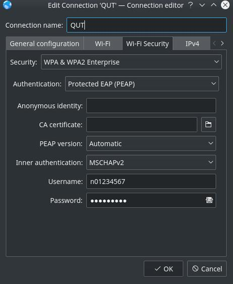
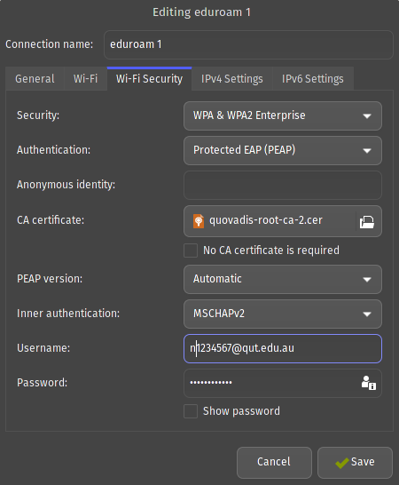

# Setting-up-Linux
September 2016
## Description 
This documents is mainly here to help me remeber what I did if I need to reload for what ever reason.  If this can help someone else, awesome.  Some obvious stuff I haven't put up for example installing node, npm or git.

## To get something installed
* (Obvious) Download the iso for the desired distro.  ie Ubuntu
* Download rufus from [Here](https://rufus.akeo.ie/).  This helps creating a bootable USB stick with the downloaded ISO.
* Boot from the USB in the computer.  
  * During the install, I chose to use UFI as the loader(?).  This has cause the BIOS's boot device selector at each power up.  

## First boot
* Find a Terminal and run:
  * `sudo apt-get update`
  * `sudo apt-get upgrade`
* Install Graphics(Works for Nvidia)
  * `sudo add-apt-repository ppa:graphics-drivers/ppa`
  * `sudo apt-get update`
  * `sudo ubuntu-drivers autoinstall`
  * `sudo reboot`
  * Noted after this the boot process took longer, don't know why

## Installing Virtual Box 
* Download VirtualBox from [Here](https://www.virtualbox.org/wiki/Linux_Downloads)
* Will also need the extension, get it [Here](https://www.virtualbox.org/wiki/Downloads)
  * The extension pack is need to pass though USB2 and USB3.  I'm sure there is other things it is good for.

## Mouse cursor echos/artifacts
If there is funny mouse artifacts/echos or what ever still hanging around.  This can be improved be changing the display settings.
* System Settings > Display > Compositor
  * You can try changing "Tearing Prevention(vsync)" to full screen repaints, but 'they' say it is more hardware intentsive.
  * The other option is to turn off OpenGL and use XRender.
* OpenGL requires an installed graphics card to render the screen.  Where as XRender is an extension of XServer and does not required graphics.  XRender also doesn't support as many features compared to OpenGL, it is simple and basic.  Explained better [here](http://stackoverflow.com/questions/22318322/what-is-the-difference-between-opengl-and-xrender-in-kde-desktop-effects)

## MATLAB
First download the massive program from their website.  
When activating, be sure to use the correct username - or else...  
If you do happen to much up the activation and get error -9.  
Go to `cd /usr/local/MATLAB/R2016a/licenses/` and rename the license file with root.  
`sudo mv license_System-One_31_R2016a.lic license_System-One_31_R2016a.licbk`  
Change the file name to suit the current version.  
Opening Matlab again will take you to the activation process.  

To get an icon created run `sudo apt-get install matlab-support`.  
No idea what else it does.  Could have also tried linking the file but this worked.

## Linking to the 'home' drive at Uni
Use WebDev protocol on Ubuntu. Windows users need to use HTTPS instead(not tested).  
An example of the link is below.  
`webdavs://estore-remote.qut.edu.au/documents/studenthome/Group56$/n123456/`  
Things to know about the above link.  
* Students are split into different groups.  The last two numbers of the student ID is what is used for the group folder.  The example has the student ID as n123456, so the group folder is Group56$.  
* The $ is nesscessary.  This means that it is a hidden share on the host server. But for some reason I can see the other folders half the time.
Cisco VPN was not needed for this to work.  If using the VPN the server is //homestud03 or something like that.  It is always hard finding details on this from the Uni.

## Replace Bash with Zsh (and make it look awesome)
There are three main parts to get started.
* Install zsh - `sudo apt-get install zsh`
* Install Oh my zsh - `curl -L https://github.com/robbyrussell/oh-my-zsh/raw/master/tools/install.sh | sh`
  This might end in a error/warning with chsh  
  If you are running zsh with the extra oh my zsh in a terminal you need to adjust the terminal settings, not just the shell.
* Ubuntu Konsole.  
  * Open a new window
  * Settings
  * Manage Profiles
  * Click edit profile
  * You should see an area called command that has `/bin/bash`, change to `/bin/zsh`
  * click apply then close the windows
  * reset konsole and it should now be zsh
Once all this is working, you can now start trying different themes
* Using an editor in the home directory ~ type `sudo nano .zshrc`
* Look for the line(about line 10) starting with ZSH_THEME="".  Inside the quotes enter the theme name.
* Theme names can be found [here](https://zshthem.es/all/)

## Dropbox
Install Dropbox from their website.  It will install any extras required.
It will create a dropbox folder in the user home directory.

## QUT Wifi
To setup the Wifi for the standard QUT network, follow the Android option.  These steps can be found [here](https://heat.qut.edu.au/HEAT/Default.aspx?Role=SelfService&Scope=SelfService&CommandId=Open&Tab=Knowledge&ItemId=F3F2947927DE43FA8053CDBFB87875A6#1473111243889).  Note, you need to have a QUT username and password to access this information.

When a picture is worth a thousand words...  

  

When adding a new wireless connection. Click the wireless security tab at the top.  
Then mimick the settings in the above image.  

## Google Drive 
TODO

## Blue tooth mouse laggy at slow speeds
TODO

## FTP
On windows I currently use a program called WebDrive which works well.  I need to find a good replacment like that for Linux.

## EduRoam
Same as QUT WiFi with a small change to the username.

## Uni Printers
TODO
